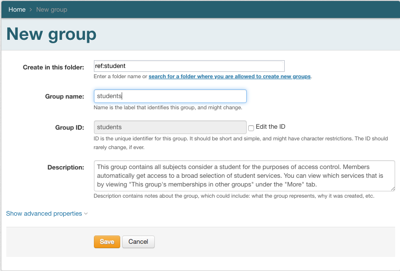
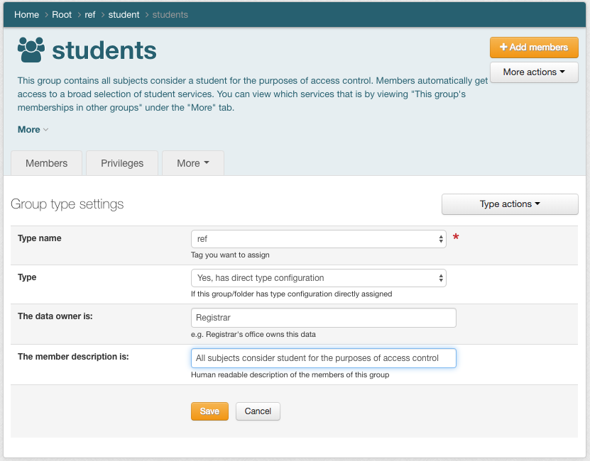
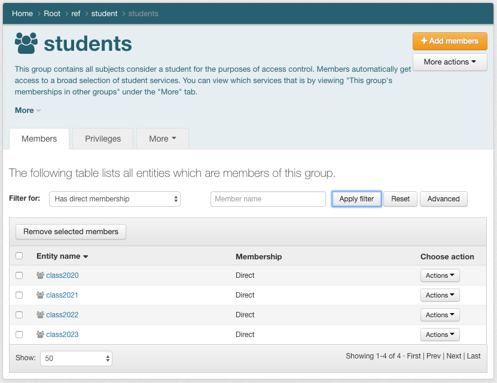
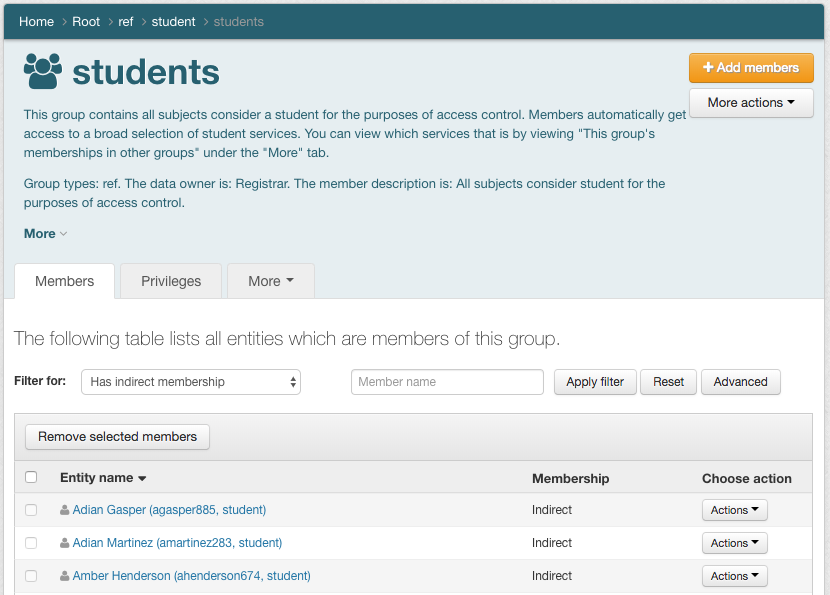
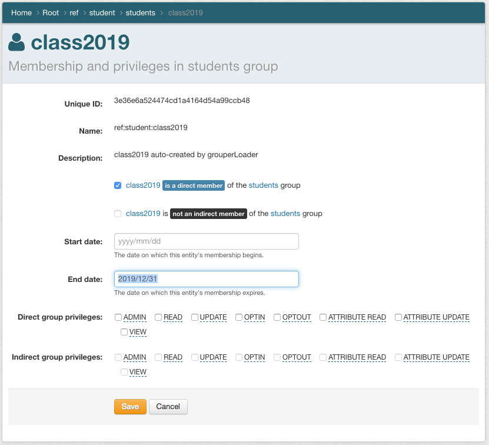
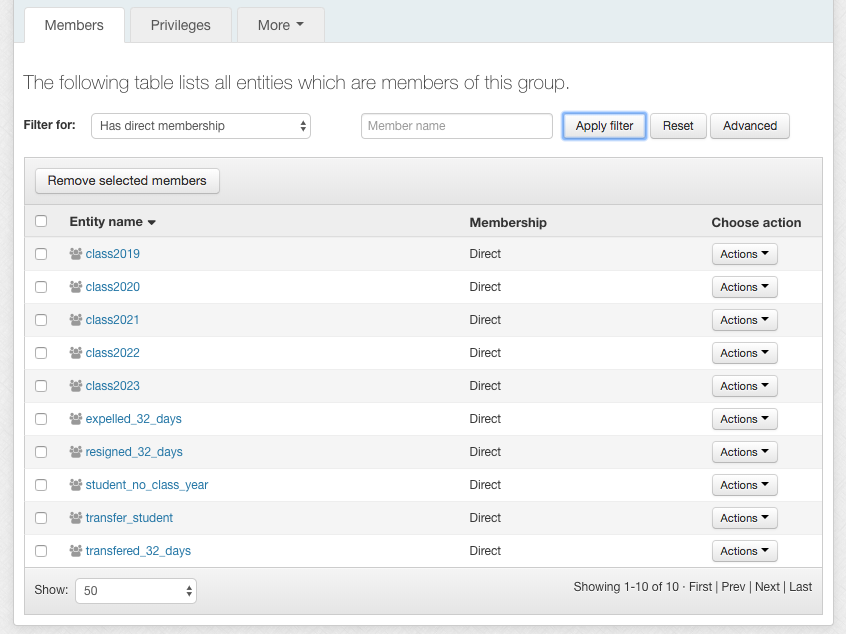
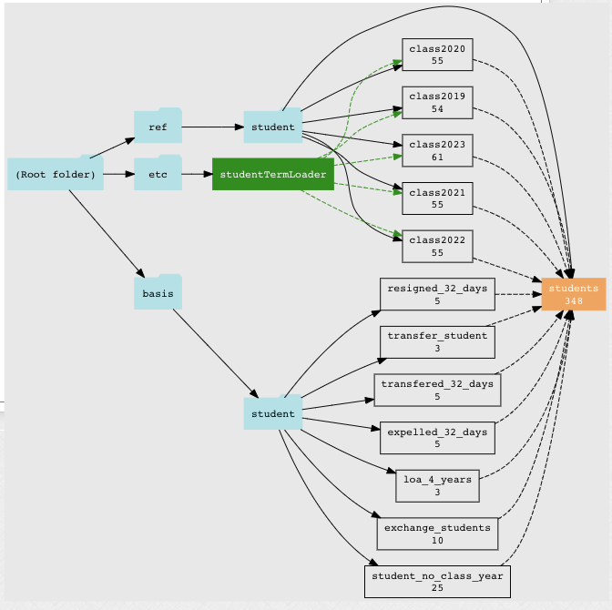

==================================
201.1 Basis and Reference Groups
==================================

-------------------
Learning Objectives
-------------------

* Create and manage reference and basis groups
* Understand the difference between reference groups and basis groups
* Implement lifecycle requirements for subject attributes

--------------
Lab Components
--------------

* Grouper
* `Grouper Deployment Guide`_

--------
Overview
--------

Often the best source of data for building institutional meaningful cohorts is
a combination of arcane codes from multiple source systems, such as a payroll
or student information system. To leverage the power of Grouper, these groups
should be brought in as raw **basis groups**.

Basis groups are used by the IAM analyst to construct institutional meaningful
cohorts that are required for access policy. Access policy does not reference
basis groups directly, rather the basis groups are used to build up reference
groups. This indirection provides the IAM analyst the ability to adjust to
changing source systems and business practices while keeping reference groups
and access policy relatively stable. Basis groups are typically only visible to
the IAM analyst, and would not normally be reflected out to applications or
enterprise directories.

Reference groups tend to be organized in particular folder locations for
convenience and ease of use, but what makes a group a reference group is not
its name or folder location, but rather its intended use, definition and scope,
and data management expectations.

A **reference group** is a set of subjects that is intended to be used by
reference within access policy. Reference groups are added as members to policy
groups. Reference groups can be thought of as tags that identify institutional
meaningful cohorts. In this way, they can also be viewed as subject attributes
from an ABAC perspective. Access policies often require cohorts organized via
institutional affiliation (faculty, staff, student), a particular office or
department (president's office, finance division, chaplain), program (chemistry
students), and even residence or class year. All of these are good examples of
reference groups.

This module will focus on creating and using basis and reference groups related
to students.

---------------------------------------------
Exercise 201.1.1 All students reference group
---------------------------------------------

Create an all student reference group to be used in access policy and the "all
students" mailing list.

Reference groups for students by class year already exist in `ref:student`.
These are being used for class year mailing lists. Membership in the class year
groups are updated automatically by the studentTermLoader job. The loader job
queries the student information system.

1. Create a new group named `ref:student:students`.
   (+ Create new group)

2. Add the "ref" type to this group.
   (More actions -> Types -> Type actions -> Edit type settings)

3. Add the following class year reference groups to `students`.
   (Members -> + Add members -> ...)

* `ref:student:class2020`
* `ref:student:class2021`
* `ref:student:class2022`
* `ref:student:class2023`

4. Filter for: Has direct membership. This shows all the reference groups that
   contribute to the `students` group.

5. Filter for: Has indirect membership. This shows every each subject who is a
   member of the '..:students' group. How many students are there?

6. You suddenly remember that recently graduated students have a grace period
   of 6 months during which they retain full student access. Add
   `ref:student:class2019` to `ref:student:students`, and then set the
   membership end date to Dec. 31, 2019. (class2019 -> Choose action -> Actions
   -> Edit membership and privileges). How many students are there now?

.. note::

        In this case, recently graduated students are still considered to be students
        for the purpose of access control.  If recent graduates only retained a few
        services, it might make more sense to add these former students to individual
        allow policies for the services in question.

-------------------------------
Exercise 201.1.2 Other students
-------------------------------

You remember that not all students have class years assigned. This includes
part-time students, employees taking courses, and non-matriculated students.
Fortunately, data about these students is available in the SIS and a basis
group has already been created for us.

#. Add `basis:student:student_no_class_year` to `ref:student:students`.  How
   many students are there now?

----------------------------------
Exercise 201.1.3 Exchange Students
----------------------------------

You campus participates in an exchange program with a sister school.  Students
from the sister school can take classes at your institution, but never have
official records in your SIS.  They do however, have a local NetID.
Registration is done directly with the registrar, and the student's home
institution maintains the student records.

#. Add `basis:student:exchange_students` to `ref:student:students`.  How many
   students are there now?

----------------------------------
Exercise 201.1.4 Transfer Students
----------------------------------

Students who transfer to your campus often need access to systems well ahead
of SIS data being fully updated.

#. Create a new basis group `basis:student:transfer_student` and add it to
   `students`

#. Add the following accounts to `transfer_student`:

* pmartinez921
* cthompson287
* agrady901

3. Check how many students there are now. The number of students did not go
   up by 3 as you might have expected. Why? One of the transfer students was
   already a member of `students`. Trace the membership on each of the
   transfer students to determine which accounts already had the `students`
   subject attribute, and why.

---------------------------------
Exercise 201.1.5 Change of Status
---------------------------------

Students who leave for a variety of reasons are given a 32 day grace period,
during which they retain student access. Basis groups for these already exist.
They include:

* `basis:student:expelled_32_days`
* `basis:student:resigned_32_days`
* `basis:student:student_transferred_32_days`

#. Add these basis groups to `students`.  How many students are there now?

------------------------------------------
Exercise 201.1.6 Leave of Absence Students
------------------------------------------

Student may also obtain a leave of absence for a variety of reasons. These
students may or may not return, but retain student access for an extend period
of time. Basis groups for leave of absence students already exists:

* `basis:student:loa_4_years` (leave of absence within the last 4 years)

#. Add `loa_4_years` to `students`.  How many students are there now?

-----------------------------------------------
Exercise 201.1.7 What do you mean by "student"?
-----------------------------------------------

The `student` reference group is used in access policy for student services.
Being a "student" means access to a broad array of student services. This
instutionally meaningful cohort is well defined, easily understood, and capable
of being extended in a rational way. Review the `students` reference group
definition by using the Grouper Visualization feature. (students -> More
actions -> Visualization)

.. _Grouper Deployment Guide: https://spaces.at.internet2.edu/display/Grouper/Grouper+Deployment+Guide+Work+-TIER+Program
