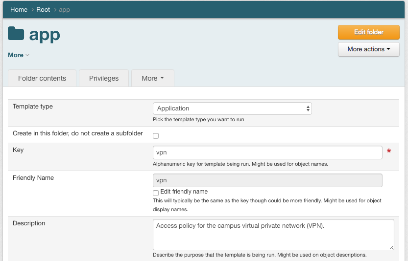
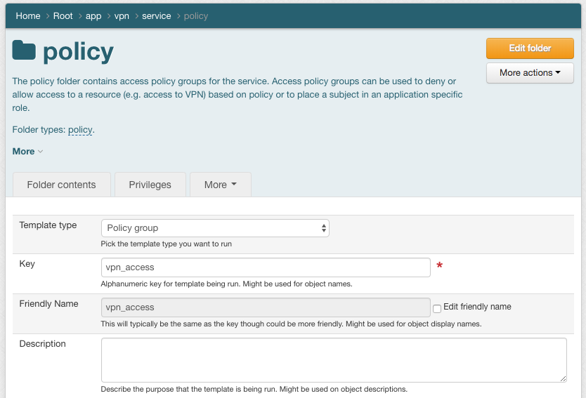
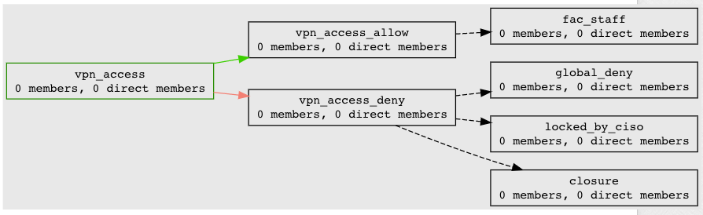
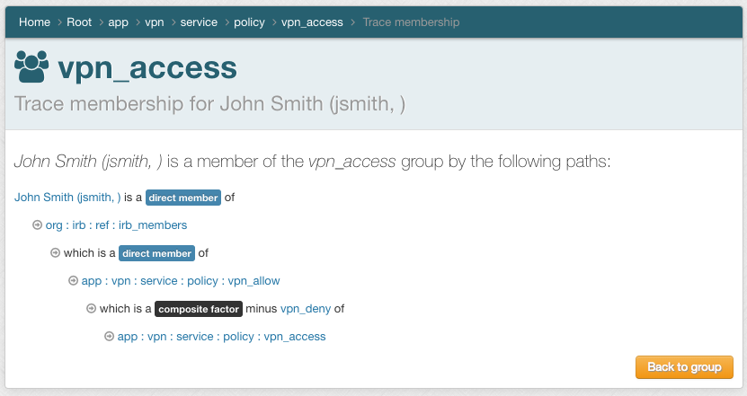
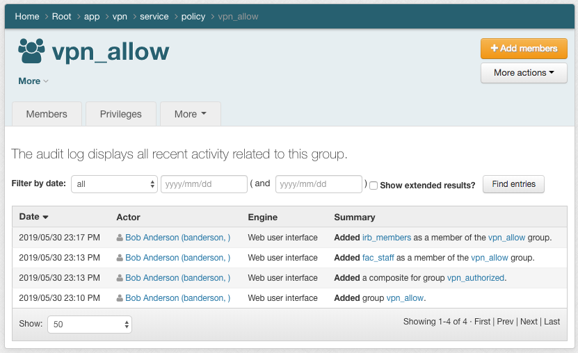
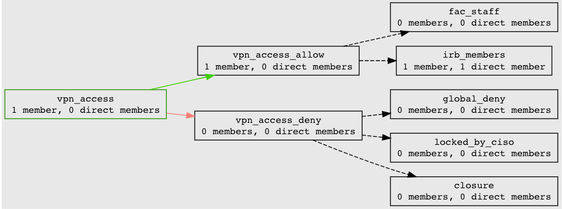
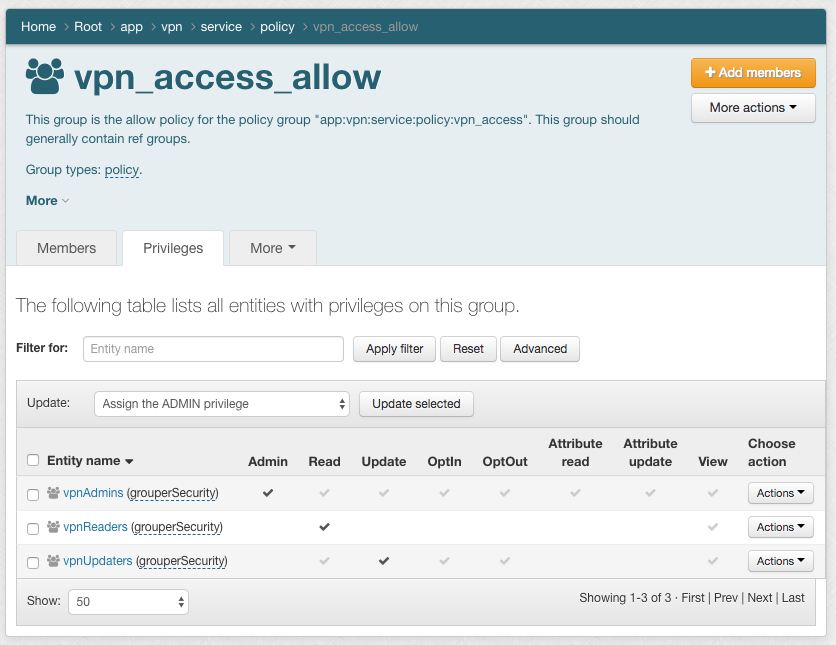

============================
201.2 Access Policy Groups
============================

-------------------
Learning Objectives
-------------------

* Translate a natural language policy group into digital policy using access
  policy groups.
* Understand the difference between policy groups and reference groups.

--------------
Lab Components
--------------

* Grouper
* `Grouper Deployment Guide`_

--------
Overview
--------

`NIST SP 800-162`_ describes how natural language policy, that is access policy
stated in common language, must be converted to digital policy for any access
control mechanism to effectively operate. Digital policy is manifest in
Grouper via access policy groups. Subject membership in an access policy group
should be indirect and represents a precomputed access policy decision based on
subject attributes (i.e. a subject’s membership in various reference groups).

An **access policy** group is a composite group whose membership is composed of
an include group (i.e. the allow group) minus an exclude group (i.e. the deny
group). Subject membership in both the allow group and the deny group should
be indirect (i.e. through reference groups) and have a clear mapping to the
natural language policy. When exceptions to policy are necessary, locally
scoped reference groups should be added.

Limiting policy groups to indirect membership assignments via reference groups
ensures that as subject attributes change, effective membership is up to date
and access control decisions are correct. It also enables the direct mapping
from natural language policy to digital policy and vice versa. Individual
exceptions to policy, while not expressly recommended, can be accommodated by
adding subjects directly to the allow/deny groups.

Membership within an access policy group is often kept in sync directly with a
target service or an intermediary like an LDAP based enterprise directory
service. Services can also query Grouper directly for membership assignment.

--------------------------------------------
Exercise 201.2.1 Application folder template
--------------------------------------------

Generally, access policy groups are organzied in a set of folders following a
common convention descripted in the Grouper Deployment Guide. A template for
this structure is available in the Grouper UI. Use the Application Template to
create a new structure for our VPN service policy.

#. Navigate to the `app` folder
#. Create a new `vpn` application structure using the Application Template
   (More actions -> New template)

3. Navigate to the `app:vpn:service:policy` folder

4. Create a new vpn_access policy group using the Policy Group Template
   (More actions -> New template)

-------------------------------------------------------------------
Exercise 201.2.2 Create digital policy from natural language policy
-------------------------------------------------------------------

The natural language policy is "all faculty and staff have access to vpn,
unless denied by CISO or the account is in a closure state".  Reference groups
are already available.

#. Add `ref:employee:fac_staff` to `vpn_access_allow`.
#. Add `ref:security:locked_by_ciso` to `vpn_access_deny`.
#. Add `ref:iam:closure` to `vpn_deny`.
#. Review the `vpn_access` policy definition
   (vpn_access -> More actions -> Visualization)

----------------------------------------------------------------------------
Exercise 201.2.3 Update policy to include institutional review board members
----------------------------------------------------------------------------

The new natural language policy is "all faculty, staff, and members of the
institutional review board have access to vpn, unless denied by CISO or the
account is in a closure state".

#. Add `org:irb:ref:irb_members` to `vpn_allow`.
#. Add *jsmith* to `org:irb:ref:irb_members`.
#. Trace membership for *jsmith* from `vpn_access`. (jsmith -> Choose
   action -> Actions -> Trace membership)

4. View the audit log on `vpn_access_allow`. (vpn_access_allow -> More actions -> View audit
   log)

5. Review policy definition for `vpn_access`.
   (vpn_access -> More actions -> Visualization)

------------------------------------------------------------
Exercise 201.2.4 Review Application template security groups
------------------------------------------------------------

Adminstrative access to the application template folders and groups is
controlled by security groups in `app:vpn:security`. Security groups are
essentially policy groups for Grouper access. Review the default privileges on
`vpn_allow`.

#. Naviage to `ref:app:vpn:service:policy:vpn_access_allow`.
#. Click on the Privileges tab.

.. _NIST SP 800-162: https://csrc.nist.gov/publications/detail/sp/800-162/final
.. _Grouper Deployment Guide: https://spaces.at.internet2.edu/display/Grouper/Grouper+Deployment+Guide+Work+-TIER+Program

