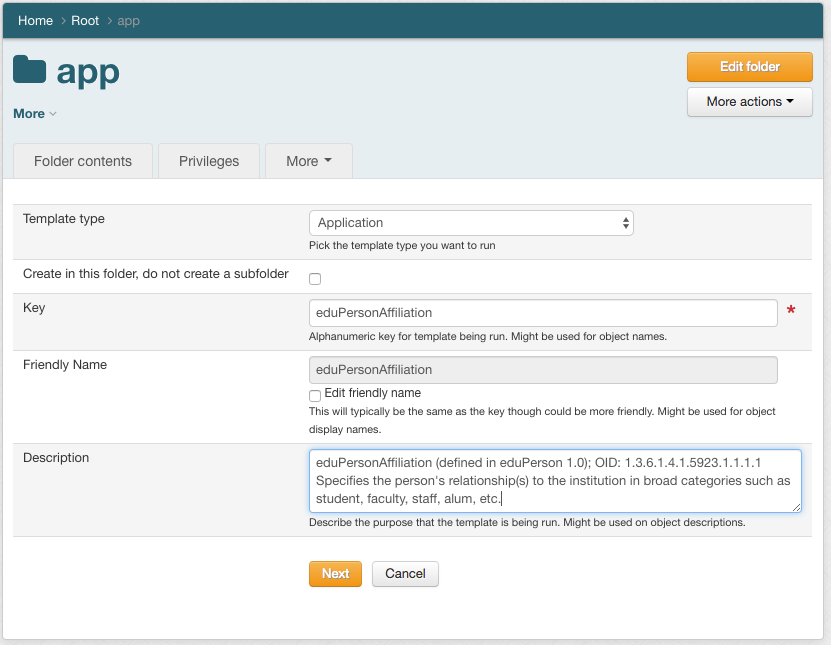
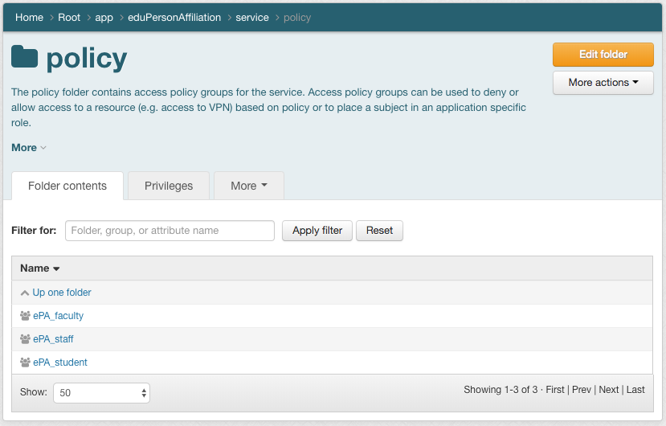
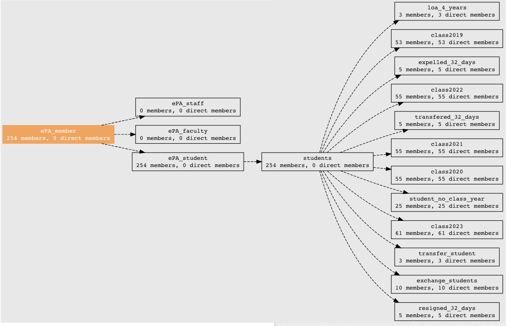
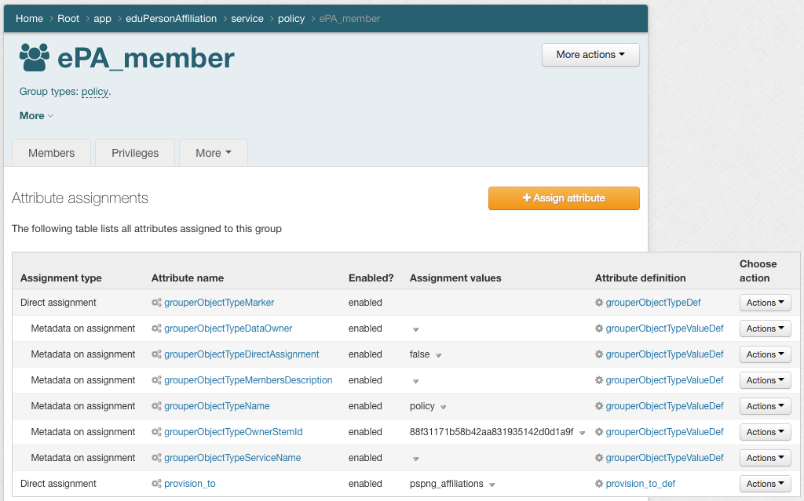
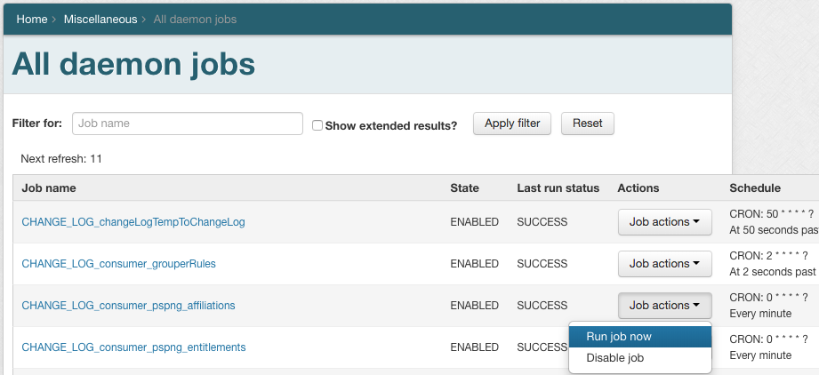
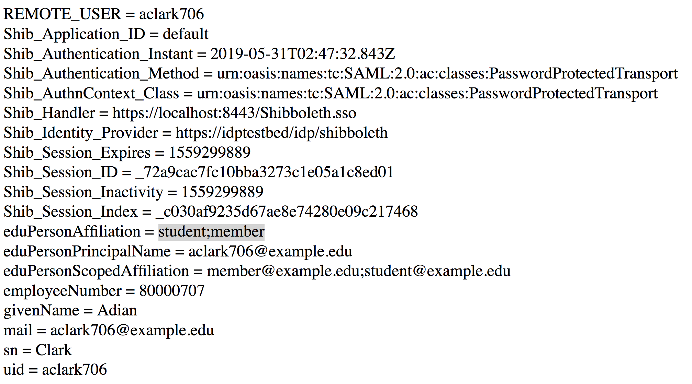

=================================================
201.3 Access Control Model 1 eduPersonAffiliation
=================================================

-------------------
Learning Objectives
-------------------

* Understand ACM1 and how to implement subject attribute management with policy
  groups
* Configure PSPNG to reflect group membership (aka subject attributes) into
  OpenLDAP
* Configure Shibboleth to release **eduPersonAffiliation**

--------------
Lab Components
--------------

* Grouper
* PSPNG
* OpenLDAP
* Shibboleth

--------
Overview
--------

`Grouper Deployment Guide`_ access control model 1 (ACM1) is all about subject
attribute management. This model is useful for cases where there exists a loose
relationship between the institution and the service provider. Assuming both
are in a multilateral SAML federation like InCommon, and a locally defined
notion of eduPersonAffiliation_ is sufficient for access control, a broad set
of services can be enabled fairly easily.

.. warning::

    This access control model is based on making subject attributes directly
    available to services and allowing the service to make access control decisions
    based on those attributes. This approach has several shortcomings:

    * The subject attributes provided often lack sufficient **context** to make
      informed access control decisions.
    * Managing changes to policy is difficult.
    * Policy decisions become opaque.

    Consider a hypothetical Learning Management System (LMS) that consumes
    **eduPersonAffiliation** attributes from subjects and grants access to a course
    management module based on whether an account has the *faculty* affiliation
    present.  At first glance, this seems like a reasonable decision.  However:

    * There are faculty who do not teach courses, and should probably not have
      access to this module (*lack of context*).
    * There are non-faculty instructors who teach courses who do need access to
      this module (*lack of context*).
    * Correcting either of the above issues is non-trivial.  Updating instructor
      accounts to assert the *faculty* affiliation may be permissible for the LMS,
      but what impact will it have on other services that employ ACM1?  Removing
      the *faculty* affiliation from faculty who don't teach courses is even more
      likely to cause issues (*managing changes to policy is difficult*).
    * Exceptions may be negotiated by configuring the IdP to release different
      affiliations based on the service provider requesting authentication (*policy
      decisions become opaque*).
    * Alternatively, exceptions may be handled by configuring them directly at
      the service provider (*policy decisions become opaque*).

------------------------------------------------------------------
Exercise 201.3.1 Create app folder for eduPersonAffiliation values
------------------------------------------------------------------
#. Navigate to the `app` folder
#. Create a new `eduPersonAffiliation` application structure using the
   Application Template (More actions -> New template)

#. Create the following groups in
   `app:eduPersonAffiliation:service:policy:`

* `ePA_student`
* `ePA_faculty`
* `ePA_staff`

---------------------------------------------------------------------------
Exercise 201.3.2 Add reference groups to eduPersonAffiliation policy groups
---------------------------------------------------------------------------

The eduPerson object class specification states:
  "Therefore each institution will decide the criteria for membership in each
  affiliation classification. What is desirable is that a reasonable person
  should find an institution's definition of the affiliation plausible."

#. Add `ref:student:students` to `...:eduPersonAffiliation:ePA_student`.

----------------------------------------------------------------------
Exercise 201.3.3 Create eduPersonAffiliation policy group for "member"
----------------------------------------------------------------------

The eduPerson object class specification states:
  "The "member" affiliation MUST be asserted for people carrying one or more of
  the following affiliations: *faculty* or *staff* or *student* or *employee*."

.. note:

    Holders of the affiliation *alum* are not typically "members" since they
    are not eligible for the full set of institutional privileges enjoyed by
    faculty, staff and students.

#. Create `app:eduPersonAffiliation:ePA_member`.
#. Add `ePA_faculty`, `ePA_staff`, and `ePA_student` to `ePA_member`.
#. Review `ePA_member` defintion (ePA_member -> More actions -> Visualization)

--------------------------------------------------------------
Exercise 201.3.4 Configure PSPNG to reflect ePA values to LDAP
--------------------------------------------------------------

#. Configure PSPNG to sync group membership to LDAP values for
   **eduPersonAffiliation**. The following is already configured for you in
   grouper-loader.properties.

   .. literalinclude:: examples/201-3-4.pspng-epa.grouper-loader.properties
        :language: properties
        :caption: grouper-loader.properties
        :linenos:

#. Assign PSPNG *provision_to* attribute to `ePA_member` with a value of
   **pspng_affiliations**. (ePA_member -> More actions -> Attribute assigments
   -> + Assign attribute -> `etc:pspng:provision_to` -> Save) (provision_to ->
   Actions -> Add value -> `pspng_affiliations` -> Submit)

3. Review and execute "Run job now" for the PSPNG affiliations change log consumer daemon
   job (Miscellaneous -> All daemon jobs)

---------------------------------------------------------------------
Exercise 201.3.5 Configure Shibboleth to release eduPersonAffiliation
---------------------------------------------------------------------

The demo Shibboleth IdP has been configured to release the ePA attribute to
the demo SP. The relevant configuration is below:

.. literalinclude:: examples/201-3-5.attribute-filter.xml
    :language: xml
    :caption: attribute-filter.xml
    :lines: 16-42
    :emphasize-lines: 9
    :linenos:

1. Open a private browser, and log in to https://localhost:8443/app with
   username `aclark706` and password `password`.

.. _eduPersonAffiliation: https://www.internet2.edu/media/medialibrary/2013/09/04/internet2-mace-dir-eduperson-201203.html#eduPersonAffiliation
.. _Grouper Deployment Guide: https://spaces.at.internet2.edu/display/Grouper/Grouper+Deployment+Guide+Work+-TIER+Program
