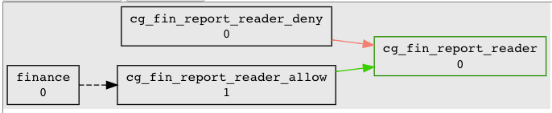
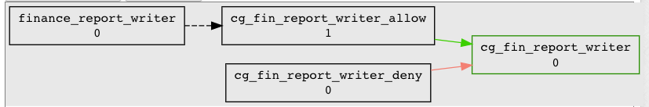
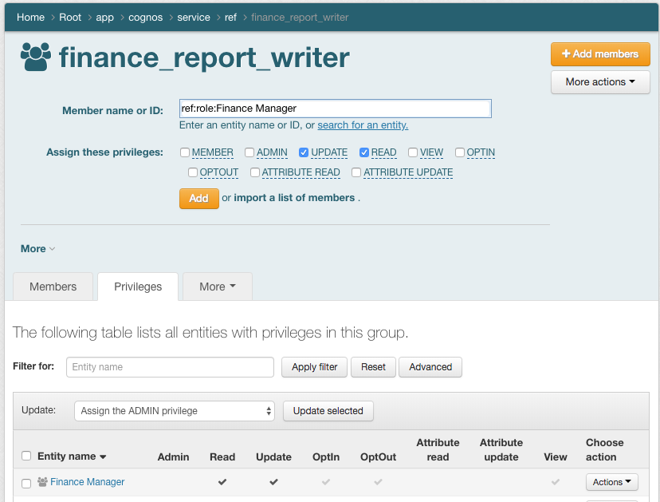
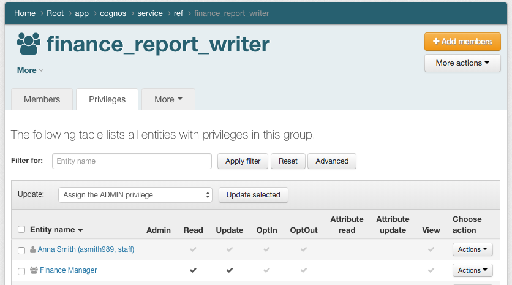
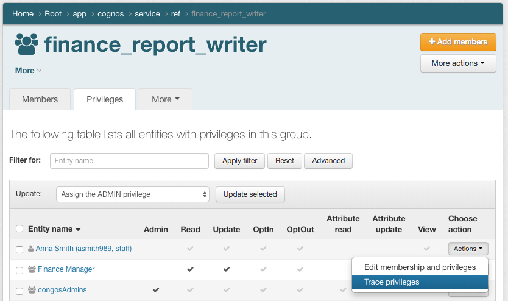
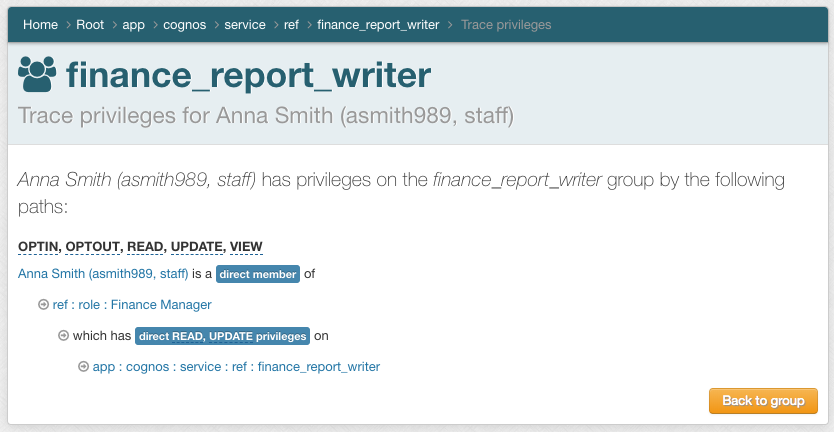
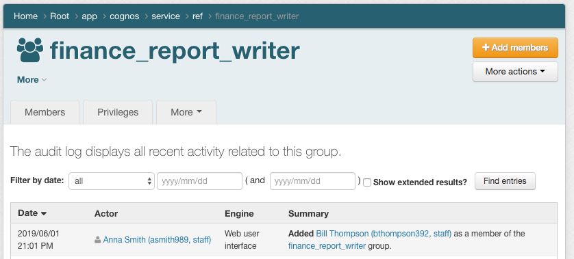
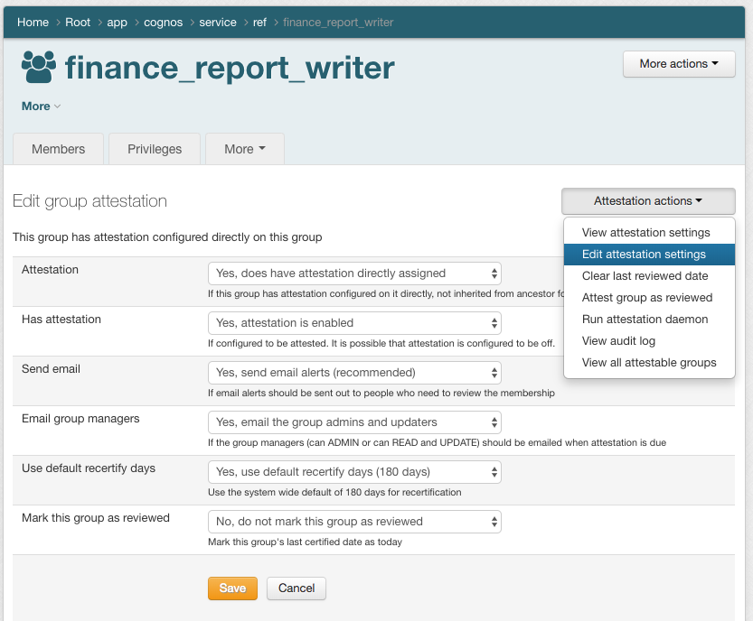
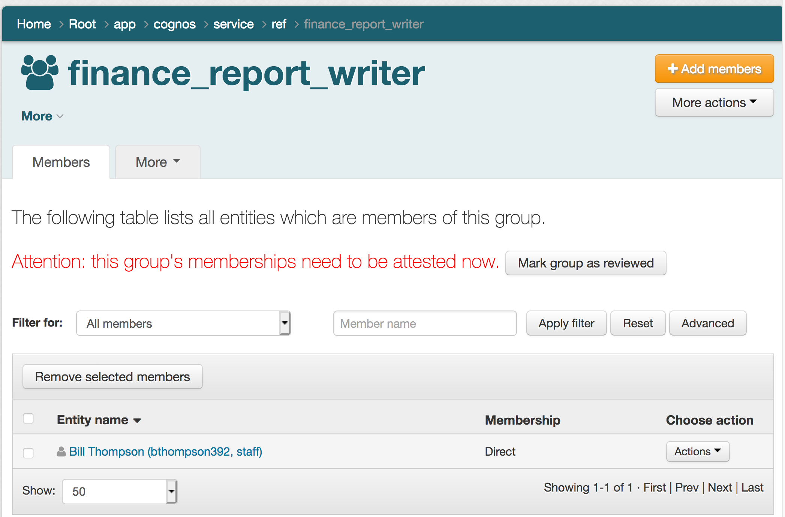
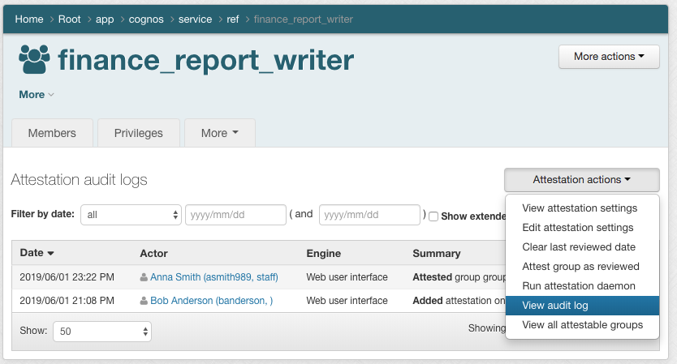

====================================================
201.5 Access Control Model 3 Subject to Role Mapping
====================================================

-------------------
Learning Objectives
-------------------

* Understand ACM3 and how to use policy groups with application specific roles
* Implement delegated access control
* Configure attestation

--------------
Lab Components
--------------

* Grouper
* `Grouper Deployment Guide`_

--------
Overview
--------

In applications with sophisticated RBAC capabilities, fine-grained permission
sets are typically configured via an administrative interface within the
application itself. These permission sets are then associated with a role name
that can be mapped to a set of users. In this model, the user to role mapping
is done in Grouper by pairing a access policy group with the role name
defined at the target service. The policy indicating which subjects are mapped
to application roles (permissions sets) can be attribute based, a simple access
control list, or some combination of both.

In ACM3, the policy adminstration point is split between Grouper and the target
service. Policy decision point and policy enforcement point are with the target
service.

ACM3 is implemented in Grouper as follows:

#. Permission sets are managed at the target service and assigned a Role Name
#. Grouper policy groups are mapped to target service Role Name
#. Subject to Role assignment is made in Grouper

-------------------------------------------------------------------
Exercise 201.5.1 Create a `congos` application folder and group set
-------------------------------------------------------------------

1. Use the Application template to create the `cognos` application folder and
   group set in the `app` folder.
2. Use the Policy template to create two new policy groups in
   `app:cognos:service:policy`

* `app:cognos:service:policy:cg_fin_report_reader`
* `app:cognos:service:policy:cp_fin_report_writer`

------------------------------------------------------
Exercise 201.5.2 Implement Report Reader Access Policy
------------------------------------------------------

All finance employees have read access to finance reports.

1. Implement the reader policy by adding `ref:dept:finance` to
   `cg_adv_report_reader_allow`.

------------------------------------------------------
Exercise 201.5.3 Implement Report Writer Access Policy
------------------------------------------------------

Only employees authorized by the Finance Manager have access to write reports

This policy will require an application specific reference group. It will be
will used as an access control list managed by the Finanance Manager.

1. Create reference group `app:congos:service:ref:finance_report_writer`.
2. Add `finance_report_writer` to `cg_fin_report_write_allow`.

---------------------------------------------------------------
Exercise 201.5.4 Delegate access control to the Finance Manager
---------------------------------------------------------------

The Finance Manager will directly managed the `finance_report_writer` access
control list.

1. Create a `ref:role:Finanance Manager` institutional reference group
2. Grant UPDATE and READ on `finance_report_writer` to `Finance Manager`

3. Add `asmith989` to `ref:role:Finance Manager`
4. Review privileges on `finance_report_writer`

5. Trace privileges for Anna Smith
   (Choose action -> Actions -> Trace privileges)

6. Open a seperate browser and log in with username `asmith989` and password
   `password`. Add `bthompson392` to `finance_report_writer`

7. Go back to `banderson` browser and review audit log for
   `finance_report_writer` (finance_report_writer -> More actions -> View audit
   log)

----------------------------------------------------------
Exercise 201.5.4 Add attestation for finance_report_writer
----------------------------------------------------------

ABAC policy groups are kept in sync automatically as subject attributes change
in the underlying business systems. Access control lists, on the otherhand,
tend to drift as soon as they are created. Grouper provides an attestation
feature that reminds group managers and owners to review group memberships, and
keeps an audit of attestation actions.

#. Add attestation requirement for `finance_report_writer`.
   (finance_report_writer -> More actions -> Attestation ->
   Attestation actions -> Edit attestation settings)

2. Log back in as `asmith989`. Review and attest the
   `finance_report_writer` membership.

3. Log back in as `bandereson`. Review attestation audit log.
   (finance_report_writer -> More actions -> Attestation ->
   View audit log)

Congrats! Your Congos access policy is clear, consistent, automated,
delegated, auditable, and attestable!

Welcome to Grouper Guru Level 2! :)

.. _Grouper Deployment Guide: https://spaces.at.internet2.edu/display/Grouper/Grouper+Deployment+Guide+Work+-TIER+Program
