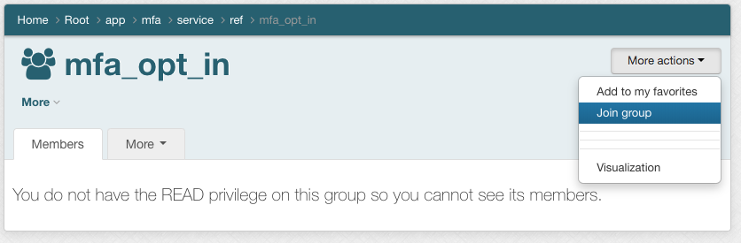

===========================
401.2 MFA Policy Governance
===========================

-------------------
Learning Objectives
-------------------

* Use Grouper policy to control Shibboleth MFA behavior
* Create `eduPersonEntitlement` value to represent desired MFA behavior
* Evolve digital policy to match changing natural language policy

--------------
Lab Components
--------------

* Shibboleth
* Grouper
* PSPNG
* OpenLDAP
* eduPerson schema - `eduPersonEntitlement`
* REFEDS MFA profile
* `Grouper Deployment Guide <https://spaces.at.internet2.edu/display/Grouper/Grouper+Deployment+Guide+Work+-TIER+Program>`_

--------
Overview
--------

Your institution is deploying multi-factor authentication (MFA). The first
target application is WebSSO. Any account enabled for MFA will experience
common MFA behaviors sufficient to assert the REFEDS MFA profile during WebSSO
authentication. The project plan calls for an initial pilot phase, followed by
a number phases where different cohorts will be required or may opt-in. During
the initial pilot phase, select cohorts will be asked to volunteer. Your
mission, should you choose to accept, is to create and evolve the digital
policy necessary to achieve the project goals.

---------------------------------------------------------------------
Exercise 401.2.1 Create initial MFA application folder set and policy
---------------------------------------------------------------------

#. Use the application template and the policy group template to create a new
   `mfa` application folder and policy group called `mfa_enabled`

#. Create a new group `app:mfa:ref:pilot`. This reference group will hold our
   pilot users and is is an access control list (ACL) as opposed to ABAC
   policy.

#. Add `app:mfa:ref:pilot` to `app:mfa:mfa_enabled_allow`.

.. figure: ../figures/401-mfa-enabled.png

-----------------------------------------------------------------------------
Exercise 401.2.2 Establish eduPersonEntitlement value to signal "MFA enabled"
-----------------------------------------------------------------------------

We will assign a unique `eduPersonEntitilement` (ePE) value to LDAP accounts
that are MFA enabled. Let's use **http://tier.internet2.edu/mfa/enabled**. as
the ePE value.

1. Configure PSPNG to provision this attribute. This is already configure for
you in `grouper-loader.properties`.

   .. literalinclude:: examples/401.2.2-pspng-config.properties
        :language: properties
        :lines: 92-100
        :caption: grouper-loader.properties
        :name: 401.2.2-pspng-groupofnames

2. Assign PSPNG `provision_to` attribute to `mfa_enabled` with a value
   of `pspng_entitlements`.

------------------------------------------------------------------
Exercise 401.2.3 Configure Shib IdP to honor MFA enabled ePE value
------------------------------------------------------------------

We will configure the Shib IdP to enfornce MFA behaviors sufficient to assert
`REFEDS MFA profile`_ in the SAML authentcation response, if the subject as an
ePE value of **http://tier.internet2.edu/mfa/enabled**.

The following is already configured for you in the GTE Shibboleth IdP.

.. literalinclude:: examples/401.2.3-general-authn.xml
   :language: xml
   :emphasize-lines: 14, 16
   :lines: 112-130
   :caption: mfa-authn-config.xml
   :linenos:

.. literalinclude:: examples/401.2.3-mfa-authn-config.xml
   :language: xml
   :emphasize-lines: 25
   :lines: 53-86
   :caption: mfa-authn-config.xml
   :linenos:

#. Add `banderson` to `mfa_pilot`.

#. Open a private browser and log in as `banderson` to the sample application
   at http://localhost:8443/app. Review the released attributes.

Excellent! We now have a working MFA policy! Adding new volunteers to the MFA
pilot is as easy as adding members to the pilot group. The next rollout phase
calls for onboarding select departments, but allow for exceptions.

-------------------------------------------
Exercise 401.2.4 Onboard select departments
-------------------------------------------

The MFA rollout is going great! Our next step is to onboard select departments,
but also account for some execptions.

1. Create `app:mfa:service:ref:mfa_bypass` for our exceptions
   to policy, and add it to `app:mfa:service:policy:mfa_enabled_deny`.

2. The CISO wants all members of central IT to be enabled. Add
   `ref:dept:Information Technology` to `app:mfa:mfa_enabled_allow`.

3. The athletics department is very excited about MFA. We don't have
   institutional reference group for them, but they gave us the following list
   of NetIDs. Import the list to `app:mfa:service:ref:mfa_athletics` as a
   temporary app-specific reference group.

.. literalinclude:: examples/401.2.4-athletics-dept.txt
    :language: text
    :caption: Athletics Department
    :linenos:

4. Add `mfa_athletics` to `mfa_enabled_allow`.

The MFA pilot is going well when the institution is hit with some direct
deposit fraud. Mandate comes from leadership to add some required cohorts. The
new policy is "any non-faculty who has access to sensitive data (i.e. Banner
INB) must have mfa enabled". The new policy should be active within two days.

----------------------------------------------------------------------------
Exercise 401.2.5 Update digital policy to reflect new natural lanague policy
----------------------------------------------------------------------------

The new natural language policy inlcudes all non-faculty employees who have
access to sensitive data in Banner. The Banner support team provides a list of
NetIDs to satisfy the "non-faculty who have access to sensitive data" part of
the policy.

#. Create `app:mfa:service:ref:NonFacultyBannerINB` and import list of NetIDs.

    .. literalinclude:: examples/401.2.5-banner-netids.txt

#. Add `NonFacultyBannerINB` to `app:mfa:service:policy:mfa_enabled_allow`, and
   edit the start date for this group to be 2 days in the future.

#. Review `mfa_enabled_allow` future membership
   (mfa_enabled_allow -> Members -> Advanced -> Enabled / disabled status ->
   Apply filter)

That’s was easy! Except-- the list is not quite right. Some faculty were
included for some reason. Need to remove faculty members before they start
calling the help desk!

-------------------------------------------------------------------------
Exercise 401.2.6 Update policy to include all Banner users except faculty
-------------------------------------------------------------------------

#. Create `app:mfa:service:ref:BannerUsersMinusFaculty`.
#. Edit this reference group to make it composite of `NonFacultyBannerINB`
   minus `ref:faculty`.

The new policy is in place and the pilot continues to expand. The next phase
calls for any faculty, staff, or student who are not already required to be
able to opt-in or out of MFA at their discretion.

----------------------------------------------------------------------
Exercise 401.2.7 Implement opt-in/out for users not required by policy
----------------------------------------------------------------------

Allow any faculty, staff, or student to opt-in/out if they are not already
required by other policy.

#. Create `app:mfa:service:ref:mfa_opt_in`. This will be an opt-in group for
   individuals who want to join or leave the service.

#. Create a new grouper security group, `app:mfa:security:mfa_opt_in`. Make
   `security:mfa_opt_in` a composite of `mfa_opt_in_allow` minus
   `mfa_opt_in_deny`. This will be the administrative access policy for access
   to `app:mf:service:ref:mfa_opt_in`.

3. Configure `service:ref:mfa_opt_in` privileges to grant
   `security:ref:mfa_opt_in` *OptIn* and *OptOut* rights.

4. Create `app:mfa:ref:mfa_required` and add it to `mfa_enabled_allow`. This
   will be the cohorts that are required to use mfa by policy. They will not be
   able to use the opt_in/out group.

5. Add the following reference groups to `mfa_required`. These cohorts
   are required to use MFA.

* `BannerUsersMinusFaculty`
* `Information Technology`
* `mfa_athletics`
* `mfa_pilot`

6. Remove the following redundant reference groups from `mfa_enabled_allow`.
   These memberships are now covered by `mfa_required`.

* `BannerUsersMinusFaculty`
* `Information Technology`
* `mfa_athletics`
* `mfa_pilot`

7. Add `app:mfa:service:ref:mfa_required` to `mfa_opt_in_access_deny`. Users
   that are required to use MFA can not opt-in/out.

8. Add faculty, staff, and student reference groups to
   `security:mfa_opt_in_allow`

9. Add `service:ref:mfa_opt_in` to `service:policy:mfa_enabled_allow`.

10. In a private browser, log in as username `awhite318` password `password`.
    Amber White can see the `mfa_opt_in` group, and can join or leave at will.

"""""""""""""""""""""""""""""
Improving the User Experience
"""""""""""""""""""""""""""""

The Grouper UI is sufficient for simple user interactions, but is not really a
great user experience. Another approach is to build a small, web-based
application to manage membership directly or via a database and grouper loader.

* Web application maintains a database of NetIDs that have opted in.
* Grouper loader job imports opt-in members into a reerence group.
* The web app needs to know what NetIDs are required to use MFA and are
  therefore ineligible to use the web app.  Grouper can be configured to
  provision `mfa_required` to eduPersonEntitilement value
  `http://tier.internet2.edu/mfa/required`.

The MFA pilot has been a success! Leadership now wants all remaining faculty,
staff, and students to be required to use MFA by policy.

-------------------------------------------------------------------------
Exercise 401.2.8 Add all remaining faculty, staff, and students to policy
-------------------------------------------------------------------------

#. Add the following reference groups directly to `mfa_enabled_allow`.

* ref:faculty
* ref:staff
* ref:student

2. Remove all intermediate policy and application reference groups.

We should now have a fairly clean app policy folder.  We were able to evolve
digital policy without affecting access to the service.

Margarita time!

.. _`REFEDS MFA profile`: https://refeds.org/profile/mfa
