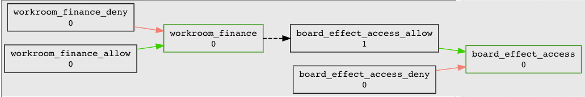

===============================
401.3 Board Effect Provisioning
===============================

-------------------
Learning Objectives
-------------------

--------------
Lab Components
--------------

* Shibboleth IdP
* InCommon Federation
* Grouper
* RabbitMQ
* Grouper ESBChangeLog Consumer
* `Grouper Deployment Guide`_

--------
Overview
--------

We have been asked to deploy a SaaS application called Board Effect. The
service is already an InCommon member and honors an `eduPersonEntitlement`
for "front door" access. Permission management within the application is
centered around "work rooms". Each work room provide access to specific
documents, chat, mailing lists, etc. The system will be used by trustees,
executives, and various committee members.

Thankfully the service is an InCommon member and using `eduPersonEntitlement`
values. However, it turns out users still need to have accounts provisioned
ahead of time in order to get access. We will need two different kinds of
policy groups. The first, the account policy group, will be mapped to an
`eduPersonEntitlement` value and also be used for provisioning accounts. The
second type, authorization groups, will provide subject to role mapping, and
are mapped to work rooms created in Board Effect. This is an example of access
control model 3 described in the `Grouper Deployment Guide`_.

------------------------------------------------------------
Exercise 401.3.1 Create application policy folder and groups
------------------------------------------------------------

#. Use the application template and the policy group template to create a new
   `board_effect` application folder and policy group called
   `board_effect_access`.

---------------------------------------------------
Exercise 401.3.2 Create policy groups for workrooms
---------------------------------------------------

Membership in a Board Effect Workroom provides access to a number of features
and content within Board Effect. A Workroom is essentially an authorization
group. Workroom membership can be updated via a REST API provided by Board
Effect. Grouper policy groups will be mapped to Board Effect workrooms and used
to provision membership updates.

A new workroom call Committee on Finance has been created in Board Effect.
Create an authorization policy group in grouper and configure provisioning.

#. Using the policy template create
   `app:board_effect:service:policy:workroom_finance|allow|deny`.

#. Add `workroom_finance` to `board_effect_access`

----------------------------------------------------
Exercise 401.3.3 Configure the Grouper ESB Connector
----------------------------------------------------

The `Grouper ESB Connector`_ is designed to enable Grouper to interface with an
ESB in order to send and receive individual events as changes occur. We'll use
the ESB Connector to send messages to rabbitMQ for provisioning the workroom
memberships.

#. The following has already been configured for you.

   .. literalinclude:: examples/401.3.2-grouper-loader.properties
        :language: properties
        :lines: 102-118
        :caption: grouper-loader.properties
        :linenos:

   .. literalinclude:: examples/401.3.2-grouper.client.properties
        :language: properties
        :lines: 61-112
        :caption: grouper.client.properties
        :linenos:

2. Write provisioner component to read rabbitMQ and update BoardEffect via REST
   API.

   .. note::

        We will not actually accomplish this step during the lab. Instead, let's
        make sure our messages are making their way to rabbitMQ.

3. Log in to http://localhost:15672/ as username `guest`, password `guest`.
4. Select the `Queues` tab, and then click on the queue named `grouper`
5. Scoll down and click on `Get Message(s)` and review the message.

.. figure:: ../figures/401-board-effect-rabbitmq.png

------------------------------------------------------------------------
Exercise 401.3.4 Configure account provisioning and eduPersonEntitlement
------------------------------------------------------------------------

All access to Board Effect is predicated on the presenence of an
eduPersonEntitlement value, and an account within Board Effect. We will use the
`board_effect_access` policy group to both control the eduPersonEntitlement
value and also provision the account to Board Effect via rabbitMQ.

#. Configure PSPNG to write `eduPersonEntitlement` value
   **https://college.boardeffect.com/** to LDAP. This value will only be
   released via the Shibboleth IdP for the Boardeffect SP. The following is
   already configured for you.

   .. literalinclude:: examples/401.3.2-grouper-loader.properties
        :language: properties
        :lines: 92-100
        :emphasize-lines: 6
        :caption: grouper-loader.properties
        :linenos:

Subject to workroom mapping is now in place and the account and workroom
provisioners are working! But how do we get reference groups for committees?
Ann in President’s Office knows.

-------------------------------------------------------
Exercise 401.3.5 Distributed Reference Group Management
-------------------------------------------------------

Ann currently maintains list of committee members by hand. Instead, she can use
a Grouper reference group.

#. Create `app:board_effect:service:ref:finance_committee`.

#. Give Ann admin access to `app:boardeffect:ref` by adding account
   **amartinez410** to `app:board_effect:security:board_effectAdmins`.

.. figure:: ../figures/401-board-effect-ann-privs.png

#. Add `finance_committee` to `workroom_finance_allow`.

.. figure:: ../figures/401-board-effect-finance-committee.png

#. In a private browser, log in as Ann Martinez (username `amartinez410`,
   password `password`). Under *My Groups* you should see the reference groups
   and policies Ann can manage.

#. Add `ksmith3` to the `finance_committee` group.

Great! Ann can now manage all the committee members directly in Grouper! Board
Effect accounts and workgroup access will be automatically provisioned and stay
in sync as Ann makes changes to the committee members.

-----------------------------------------
Exercise 401.3.6 Committee member helpers
-----------------------------------------

Our access strategy is working great for committee members. However, many
committee members have assistants who also needs access to the committee
workrooms. Rather than have Joe share his credentials, let's extend our access
strategy to account for this addition to policy.

#. Create app specific ref group
   `app:board_effect:service:ref:finance_committee_helpers`.

#. Add `finance_committee_helpers` to `:workroom_finance_allow`.

.. note::

    By *not* adding the helper subjects directly to `finance_committee`, we
    preserve the fidelity of the subject attributes.  Members of
    `finance_committee` *are* members of the Finance Committee.  The helpers
    are *not* members of the committee, but they *are* granted access to the
    workroom by the policy.

This works great for specific assistants, but there are also general helpers
who need access to all workrooms *temporarily* during board meetings.

#. Create app specific ref group
   `app:board_effect:service:ref:workroom_helpers`.

#. Run the following gsh script to add a 3 day age off rule to
   `workroom_helpers`. In a termimal window run "./gte-gsh 401.1.1", then paste
   the following:

.. code-block:: groovy

   group_name = "app:board_effect:service:ref:workroom_helpers";
   workroom_helpers = GroupFinder.findByName(gs, group_name);
   numDays = 3;
   actAs = SubjectFinder.findRootSubject();
   attribAssign = workroom_helpers.getAttributeDelegate().addAttribute(RuleUtils.ruleAttributeDefName()).getAttributeAssign();
   attribValueDelegate = attribAssign.getAttributeValueDelegate();
   attribValueDelegate.assignValue(RuleUtils.ruleActAsSubjectSourceIdName(), actAs.getSourceId());
   attribValueDelegate.assignValue(RuleUtils.ruleRunDaemonName(), "F");
   attribValueDelegate.assignValue(RuleUtils.ruleActAsSubjectIdName(), actAs.getId());
   attribValueDelegate.assignValue(RuleUtils.ruleCheckTypeName(), RuleCheckType.membershipAdd.name());
   attribValueDelegate.assignValue(RuleUtils.ruleIfConditionEnumName(), RuleIfConditionEnum.thisGroupHasImmediateEnabledNoEndDateMembership.name());
   attribValueDelegate.assignValue(RuleUtils.ruleThenEnumName(), RuleThenEnum.assignMembershipDisabledDaysForOwnerGroupId.name());
   attribValueDelegate.assignValue(RuleUtils.ruleThenEnumArg0Name(), numDays.toString());
   attribValueDelegate.assignValue(RuleUtils.ruleThenEnumArg1Name(), "T");

#. Add `workroom_helpers` to all `workroom_finance_allow`.

.. figures:: ../figures/401-board-effect-workroom_helpers.png

This Grouper access governance stuff is sweet! :)

-----------------------------------------
Exercise 401.3.7 Ann's Grouper Privileges
-----------------------------------------

We added Ann to board_effectAdmin so she could manage `finance_committee`
membership. But that also gives her full administrative access to the board_effect
app folder, including the security and policy groups. We can do better!

Responsibility for committee member management always goes to
the president's executive assistant, whoever that might be. Let's create an
institutional role for that, and implement least privilege access.

#. Create a new institutional reference group, `ref:roles:president_assistant`.

#. Add `amartinez410` to `president_assistant`.

#. Add `ref:roles:president_assistant` to
   `app:board_effect:security:board_effectUpdaters`.

#. Review Privileges on `finance_committee`.

5. Remove `amartinez410` from `board_effectAdmins`.

6. Review Privileges on `finance_committee`.

7. Trace privileges for Ann on `finance_committee`.
   (on Privileges tab: amartinez410 -> Actions -> Trace privileges)

---------------------------------------------------------------
Exercise 401.3.8 Institutional board committee reference groups
---------------------------------------------------------------

The Board Effect policy is working great when a new SaaS system deployment
request comes in that also has access policy based on board committees. We
need to elevate the Board Effect application-specific reference groups to
institutional reference groups.

#. Create a `ref:board` folder for board committee reference groups.

#. Move `app:board_effect:service:ref:finance_committee` to
   `ref:board:finance_committee`. (finance_committee -> More actions ->
   Move group -> Move to this folder: `ref:board`)

    .. note::

        The Board Effect access policy groups are not impacted by moving the
        location of the reference groups!

#. Create a `ref:board:security` security folder.

#. Create a `ref:board:security:boardUpdaters` security group.

#. Assign `boardUpdaters` *UPDATE* and *READ* rights on
   `ref:board:finance_committee`

#. Add `president_assistant` to `ref:board:security:boardUpdaters`.

#. Review `ref:board:finance_committee` privileges

.. warning::

      Moving our reference groups did *not* remove the access we had granted
      to them from application-specific security groups.  After moving a
      reference group, it is good practive to review its privilege assignments.

8. Revoke *UPDATE* and *READ* rights for
   `board_effectUpdaters`, `board_effectAdmins`, and `board_effectReaders`.

9. Review `finance_committee` privileges.

Congrats! You have established a new set of institutional reference groups,
verified their adminstrative access. And all without impacting current
services!

--------
Epilogue
--------

A request comes in for four new advisory council workrooms. Initially, you are
handed a spreadsheet with the council members NetIDs. You import them into
app-specific reference groups (e.g. `advisory_council_northeast`), and set up
workroom policy groups as before. Later on, you find out that the council
membership is available in Banner, so you create loader jobs for those. As it
turns out, the spreadsheets were old and had the wrong members. Thank goodness
for loader jobs! Alas, not all advisory council members have NetIDs. But fear
not, we simply get them NetIDs using our `COmanage`_ sponsored accounts system.

The End

.. _Grouper Deployment Guide: https://spaces.at.internet2.edu/display/Grouper/Grouper+Deployment+Guide+Work+-TIER+Program
.. _Grouper ESB Connector: https://spaces.at.internet2.edu/display/Grouper/Grouper+ESB+Connector
.. _COmanage: https://www.internet2.edu/products-services/trust-identity/comanage/
