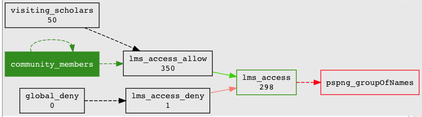

==========================================================
401.4 Untangling Legacy Access Policies - Example Solution
==========================================================

The following solution uses techniques demonstrated in the 201 and 401 labs.
The general solution is to create an independent access policy for the LMS
service based on the legacy community members LDAP group and a new visiting
scholars reference group.

#. Create a new application folder `lms`
#. Create a new access policy group `lms_access`
#. Configure PSPNG attributes to `provision_to` `groupOfNames` on `lms_access`
#. Create a new institutional reference `ref:legacy:community_members`.
#. Configure `community_members` with an LDAP loader job.
#. Add `community_members` to `lms_access_allow`
#. Create an application-specific reference group for the visiting scholars
   `app:lms:service:ref:visiting_scholars`
#. Import the NetID list into `visiting_scholars`
#. Add `visiting_scholars` to `lms_access_allow`
#. File a ticket with Vicky to switch the LMS LDAP access control group
#. Head to your happy place! :)

Congrats! You are now a certified Grouper Guru level 4!
